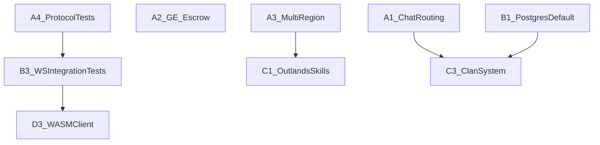

# OpenMMO Roadmap

**Last reviewed:** 2026-09-10

## Vision & principles

OpenMMO is an open-source, post-apocalyptic tile-based MMO built with a custom Rust engine. Core design goals:

- **Server-authoritative** — all gameplay outcomes (XP, loot, movement, economy) resolve on the tick loop
- **YAML-driven content** — items, NPCs, regions, quests, and skills ship as data, not code
- **Creator-friendly SDK** — third-party content packs validate against `openmmo-sdk` schemas

See [architecture.md](architecture.md) for component layout and data flow.

## Status summary

| Phase | Goal | Status |
|-------|------|--------|
| Phase 0 — Foundation | Workspace, engine, protocol, infra, CI | **Complete** |
| Phase 1 — Core loop MVP | Skills, harvest/refine/combat, inventory/bank/chat | **Complete** |
| Phase 2 — Content pipeline | YAML content, validator, tutorial quest | **Complete** |
| Phase 3 — Economy & social | GE, trading, friends, ledger, minigames | **Mostly complete** |
| Phase 4 — Hardening | Anti-cheat, auth, persistence, docs | **Partial** — auth/redis added; postgres opt-in |
| Phase 5 — Tooling | Atlas pipeline, WASM, plugins, editor | **Partial** — stubs expanded |

## World v1 (2026-09-10, branch `world-v1`)

- **Map format:** regions are ASCII `layout` + `legend` (see `crates/sdk/src/tiles.rs`), generated from hand-placed districts by `tools/worldgen/build_maps.py`. 16 `TileKind`s with shared walkability; a reachability lint.
- **World:** Verdant Reach hub (80×80: walled town with bank/shops/stations, birch woods, copper ridge, pools, ruins, bandit camps) + Copper Hollow cave, Wisp Warren dungeon, Bandit Ridge mountaintop, Shattered Coast — linked by cave mouths, an iron door, stairs and a road.
- **Content:** coherent item ids; scrap/bronze/iron/steel gear, 3 tiers of timber/ore/fish, food that heals; 11 hostile NPC types up to the Ridge Warlord; town NPCs with dialogue; two shops; stations (bank chest, furnace, anvil, workbench, cookfire, trade board) that gate the matching actions.
- **Rendering:** tile palette, procedural props, portals, NPC bodies by archetype, dim caves.
- **UI:** RuneScape-classic layout — minimap + HP orb, icon-tabbed side panel, grid inventory with procedural icons, chat tabs, hover text, bank/shop/crafting/trade-board/dialogue windows.
- **Server:** shop selling, eating, equip level requirements, station proximity, per-node respawn.

## Recent fixes (2026-09-10)

- **Deployment:** server on Railway (`wss://server-production-2a39.up.railway.app/ws`), Dockerfile, Windows client releases on `v*` tags
- **Accounts:** Argon2id passwords, account↔character binding, duplicate-login eviction, autosave + graceful shutdown
- **Spawn region:** regions sorted by id; new players spawn in Verdant Reach again (was the empty Shattered Coast)
- **Combat:** player melee range is footprint-aware and out-of-range players re-path; fixes standing still and dying to multi-tile NPCs

## Older fixes (2026-06-27)

- **Shop:** `DialogueSelect` sends `dialogue_id` so nested dialogue opens shop correctly
- **XP:** Combat/harvest/refine sync `SkillUpdate` + `XpDrop`; HUD floaters persist 1.5s
- **Combat timing:** `attack_ticks` on weapons and NPCs; cooldown-based swings (no random coin flip)
- **Hover highlight:** Accent outline on hovered entity/tile in 3D view
- **GE:** Fixed offer removal index bug when matching buy/sell orders
- **Spells UI:** Cast spells from Skills tab when in combat
- **Auth:** Password + account table when `DATABASE_URL` + `--features postgres`
- **Redis:** Session cache when `REDIS_URL` + `--features redis`
- **Content:** Fishing rod, second region (`shattered_coast`), functional minimap dot

## Test matrix

See [testing.md](testing.md). CI runs `cargo test --workspace`, fmt, clippy, content-validator, region-linter.

---

## Tier A — Gameplay polish (highest priority)

Close functional gaps in shipped systems. Low architectural risk; high player-facing impact.

| ID | Item | Status | Key files |
|----|------|--------|-----------|
| A1 | Chat channel routing (Local/Global/Clan) | **Complete** | `crates/server/src/social.rs`, `crates/engine/src/ui/mod.rs` |
| A2 | Grand Exchange seller escrow on match | **Complete** | `crates/server/src/economy.rs` |
| A3 | Multi-region travel | **Complete** | `crates/sdk/src/content.rs`, `crates/server/src/state.rs`, `content/regions/` |
| A4 | Full protocol serde tests | **Complete** | `crates/protocol/src/messages.rs` |

### A1. Chat channel routing

**Problem:** Protocol defines `Local`, `Global`, `Clan`, `Private`, but `broadcast_chat()` does not filter recipients. Client always sends `ChatChannel::Local`.

**Deliverables:**

- Server: Local = same region, Global = all online, Clan = `clan_members` lookup
- Client: channel picker in chat UI
- Unit tests in `social.rs`

**Depends on:** nothing (A3 improves Local accuracy once regions are wired)

### A2. Grand Exchange seller inventory

**Problem:** Sell offers debit inventory at placement, but matching lacked explicit escrow validation and end-to-end test coverage.

**Deliverables:**

- Escrow tracked via offer `quantity` for sell orders
- Unit test: place sell offer → inventory debited → match → buyer receives items
- Unit test: cancel returns escrowed items

**Depends on:** nothing

### A3. Multi-region travel

**Problem:** `shattered_coast` region exists; players cannot transition between regions.

**Deliverables:**

- `RegionTransition` in region YAML schema
- Server: per-region walkable tiles, entity tagging, transition on walk
- Protocol: `RegionChanged` message with region-scoped entity snapshot
- Client: update active region and entity list on transition
- Region linter validates transition targets

**Depends on:** nothing

### A4. Full protocol serde tests

**Deliverables:** Roundtrip JSON encode/decode for every `ClientMessage` and `ServerMessage` variant.

**Depends on:** nothing

---

## Tier B — Production hardening

Required before public self-hosting or multi-shard deployment.

| ID | Item | Status | Key files |
|----|------|--------|-----------|
| B1 | Postgres in production (Dockerfile builds with `postgres,redis`) | **Complete** (2026-09-10) | `Dockerfile`, `crates/server/src/persistence.rs` |
| B2 | Redis sessions in production path | **Complete** (2026-09-10) | `crates/server/src/session.rs`, Railway |
| B3 | WebSocket integration tests | Open | `.github/workflows/ci.yml` |
| B4 | Audit log persistence | **Complete** — pooled writes to `audit_log` | `crates/server/src/persistence.rs` |
| B5 | CI release workflow (Windows client zip on `v*` tags) | **Complete** (2026-09-10) | `.github/workflows/release.yml` |
| B6 | Account security: Argon2id passwords, account↔character binding, duplicate-login eviction, autosave + graceful shutdown | **Complete** (2026-09-10) | `persistence.rs`, `ws.rs` |
| B7 | Connection/chat rate limiting, working ban list | Open | `crates/server/src/anticheat.rs`, `ws.rs` |
| B8 | Clippy clean under `-D warnings` (CI currently red on ~50 pre-existing lints) | Open | workspace |
| B9 | `engine::model::tests::tiger_glb_loads_geometry` fails a depth assertion (asset vs. test drift) | Open | `crates/engine/src/model.rs`, `assets/models/Tiger_001.glb` |

**Depends on:** B3 after A4; B7 before open signups

---

## Tier C — Content & gameplay expansion

| ID | Item | Status | Key files |
|----|------|--------|-----------|
| C1 | Outlands skills (Wrangling, Ranching, Engineering) | Open | `content/skills/`, `crates/server/src/state.rs` |
| C2 | Fishing skill loop | **Complete** — 3 tiers of pools, rods, cookfires | `content/objects/nodes.yaml`, `content/recipes/` |
| C3 | Clan system (create/join/leave) | Open | `crates/server/src/social.rs`, protocol |
| C4 | Minigame & ledger depth | Open | `crates/server/src/minigame.rs` |
| C5 | Additional regions & quest chains | **Regions complete** (5); quest chain still one quest | `content/regions/`, `content/quests/` |
| C6 | Quest chain through every district (talk → chop → smelt → fish → cave → coast) | Open | `content/quests/` |
| C7 | Death mechanics (drop-on-death vs. keep), gravestones | Open | `crates/server/src/tick.rs` |

**Depends on:** C1 and C5 after A3; C3 after A1 + B1

---

## Tier D — Rendering, platform, and creator tools (Phase 5)

| ID | Item | Status | Key files |
|----|------|--------|-----------|
| D1 | Sprite atlas pipeline (PNG packing) | Open | `tools/atlas-packer/`, `crates/engine/src/renderer.rs` |
| D2 | GLB model rendering improvements | Open | `crates/engine/src/model.rs`, `assets/models/` |
| D3 | WASM browser client | Open | `crates/engine/src/lib.rs` |
| D4 | Plugin sandbox (WASM/Lua) | Open | `crates/server/src/anticheat.rs`, `crates/sdk/src/manifest.rs` |
| D5 | Visual editor | Open | `templates/openmmo-editor/` |

**Depends on:** D3 after B3; D4 after B1; D5 optionally after D1

---

## Creator ecosystem (parallel track)

| Item | Path | Work |
|------|------|------|
| Content pack template | `templates/openmmo-game-template/` | Expand examples, publish to crates.io |
| SDK publishing | `crates/sdk/` | Versioned releases, changelog |
| CONTRIBUTING.md | new | Dev setup, PR guidelines, roadmap link |
| Issue templates | `.github/ISSUE_TEMPLATE/` | Bug, feature, content pack |

---

## Known gaps register

| Gap | File(s) | Tier | Notes |
|-----|---------|------|-------|
| Chat routing | `social.rs`, `app.rs` | A1 | Done |
| GE seller escrow | `economy.rs` | A2 | Done |
| Multi-region travel | `state.rs`, region YAML | A3 | Done |
| Outlands skills not initialized | `state.rs`, skill YAML | C1 | YAML ahead of gameplay |
| Postgres/redis opt-in | `server/Cargo.toml` | B1–B2 | Requires `--features` |
| Atlas PNG packing | `tools/atlas-packer` | D1 | Manifest-only MVP |
| WASM client | `engine/src/lib.rs` | D3 | `wasm_main` stub |
| Plugin sandbox | `anticheat.rs` | D4 | `on_tick` hook only |
| Visual editor | `templates/openmmo-editor` | D5 | Scaffold only |

---

## Dependency graph

### Suggested release themes

1. **Polish release** — A1, A2, A4
2. **World expansion** — A3, C2, C5
3. **Production release** — B1, B2, B3, B4, B5
4. **Outlands release** — C1, C3, C4
5. **Platform release** — D1, D2, D3
6. **Creator release** — D4, D5, ecosystem docs

---

## Completed tier items

### Tier A (prior)

- [x] Spell casting UI (Skills tab → `CastSpell`)
- [x] GE unit tests + index fix
- [x] Speed-hack detection on movement steps
- [x] Chat channel routing (Local/Global/Clan)
- [x] Full protocol serde tests
- [x] Multi-region travel (Verdant Reach ↔ Shattered Coast)
- [x] GE seller escrow end-to-end tests

### Tier B (prior)

- [x] Password auth (postgres feature)
- [x] Redis session role defined

### Tier C (prior)

- [x] Second region YAML (`shattered_coast`)
- [x] BETA skills initialized at login (`state.rs`)
- [x] Specialization picker UI
- [x] Collection log client handler
- [x] Minimap player position
- [x] Fishing rod item + shop stock

---

## How to update

When closing roadmap items:

1. Update the status table and checkboxes in this file
2. Add or update test expectations in [testing.md](testing.md)
3. Move completed items to the "Completed tier items" section
